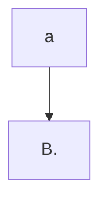
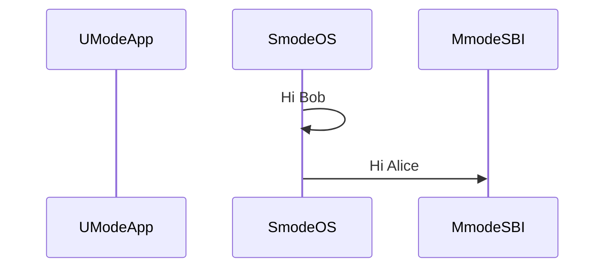
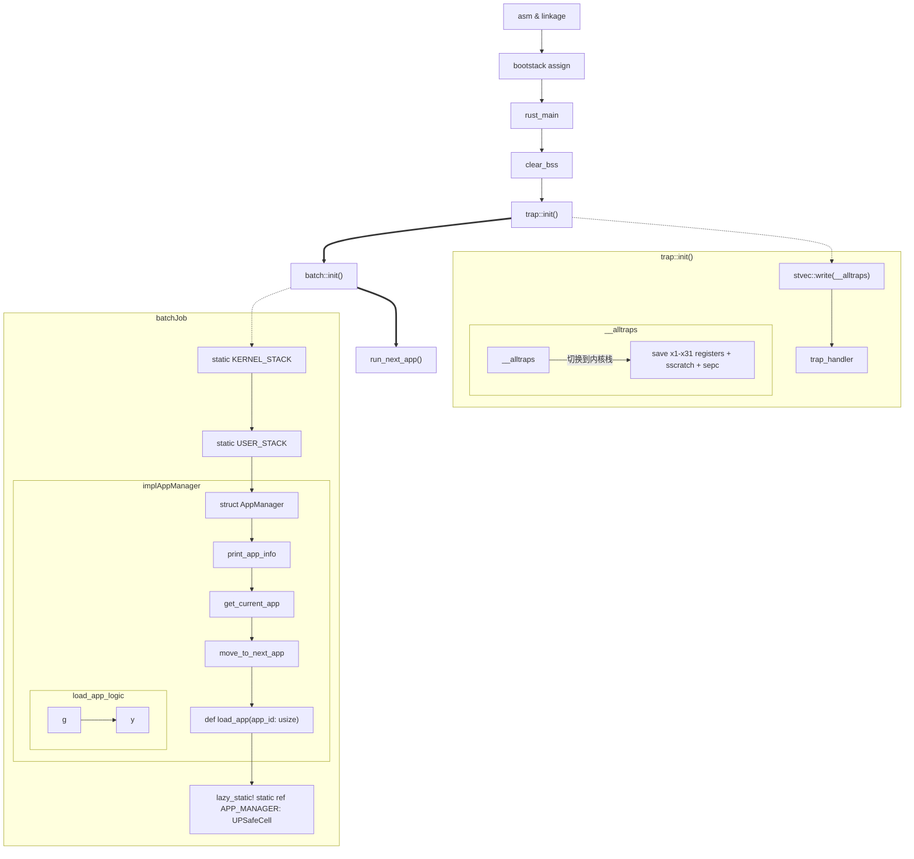

## 批处理

```mermaid
graph TD

a --> b[B.]
```

323

```mermaid
sequenceDiagram
    participant UModeApp
    participant SmodeOS
    participant MmodeSBI
    SmodeOS->>SmodeOS: Hi Bob
    SmodeOS->>MmodeSBI: Hi Alice
```
213

```mermaid
graph TD
    a["asm & linkage"] --> b[bootstack assign]
    b --> rust_main
    rust_main --> clear_bss
    clear_bss --> c["trap::init()"]
    c -.-> c2
    subgraph "trap::init()"
        %%direction LR
        c2["stvec::write(__alltraps)"]
        c2 --> trap_handler
        subgraph "__alltraps"
            t1["__alltraps"] --> |切换到内核栈|c3["save x1-x31 registers + sscratch + sepc"]
        end
    end
    c ==> j["batch::init()"]    
    j ==> r["run_next_app()"]
    j -.-> j2
    subgraph batchJob
        j2["static KERNEL_STACK"] --> j3["static USER_STACK"]
        j3 --> j4[struct AppManager]
        subgraph implAppManager
        j4 --> j5[print_app_info]
        j5 --> j6[get_current_app]
        j6 --> j7[move_to_next_app]
        j7 --> j8["def load_app(app_id: usize)"]
        
        subgraph load_app_logic
            g --> y
        end
        end
        j8 --> j9["lazy_static! static ref APP_MANAGER: UPSafeCell<AppManager> "]
    end
```